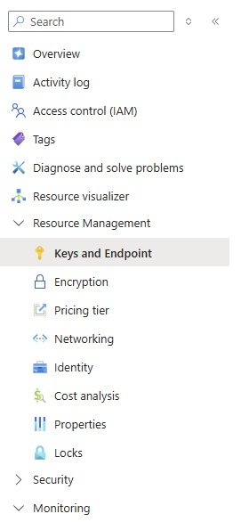
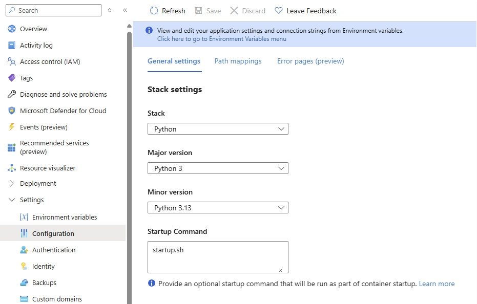

# Project


# NLWeb

Add LLM chat functionality to your existing web pages by leveraging your site schema

-----------------------------------------------------------------

## License 

NLWeb uses the [MIT License](LICENSE).


## Getting Started

Use these instructions to run an NLWeb server locally (for demo or test purposes)

### Prerequisites

These instructions assume that you have an [Azure subscription](https://go.microsoft.com/fwlink/?linkid=2227353&clcid=0x409&l=en-us&icid=nlweb), the [Azure CLI installed locally](https://learn.microsoft.com/cli/azure/install-azure-cli), and have Python 3.9+ installed locally.


### Local Setup

1. Clone or download this repository.
```
git clone https://github.com/microsoft/NLWeb
cd NLWeb
```

2. Create a virtual environment, replacing 'myenv' with the name you want to give your environment.
```
python -m venv myenv
```

3. Activate the virtual environment - again, replace 'myenv' with the name you selected above.   
```
source myenv/bin/activate    # Or on Windows: myenv\Scripts\activate
```

4. Install the dependencies.
```
cd code
pip install -r requirements.txt
```

5. Create an Azure OpenAI resource at https://portal.azure.com/#create/Microsoft.CognitiveServicesOpenAI following the instructions at https://learn.microsoft.com/azure/cognitive-services/openai/how-to/create-resource.
When you get to the "[Deploy a model](https://learn.microsoft.com/en-us/azure/ai-services/openai/how-to/create-resource?pivots=web-portal#deploy-a-model)" section, you will need to repeat this step **3 times** to deploy three base models: gpt-4.1, gpt-4.1-mini, and text-embedding-3-small.  

6. Setup your service API keys.  Copy the `.env.template` file into a new file named `.env` and add your API keys into the .env file.  If you are participating in the private preview, some of these API keys will be provided for you in a separate document.  

You can find the API key and endpoint of the Azure OpenAI resource that you created in step 5 in the [Azure portal](https://portal.azure.com/?feature.msaljs=true#view/Microsoft_Azure_ProjectOxford/CognitiveServicesHub/~/OpenAI), not [Azure AI Foundry](https://ai.azure.com) where you were deploying the models.  Click on the Azure OpenAI resource, and then in the left-hand sidebar under "Resource Management", select "Keys and Endpoint".   



For instructions on obtaining the required Azure service keys, see [this quickstart](https://learn.microsoft.com/en-us/azure/ai-services/openai/chatgpt-quickstart?tabs=api-key) or refer to the [Azure Search example](https://learn.microsoft.com/azure/search/search-security-api-keys) for step-by-step details.

7. Run a quick connectivity check:
```
python azure_connectivity.py
```

8. If you are participating in the private preview, modify your local copy of the [config_nlweb.yaml](code\config\config_nlweb.yaml) to scope the `sites` to search over your website only.  

9. Run the application locally:
```
python app-file.py
```

10. Navigate to the local site and start your chat:  http://localhost:8000/html/str_chat.html.  You can also experiment at http://localhost:8000/html/nlwebsearch.html.  


## Deploying to Azure

### Option 1: Azure Portal Deployment

1. Create a [Web App in Azure Portal](https://portal.azure.com/?feature.msaljs=true#view/WebsitesExtension/AppServiceWebAppCreateV3Blade):
   - Create a new resource group and instance name.  
   - Publish: Code
   - Choose Python 3.13 as the runtime stack
   - Select Linux as the operating system
   - Select "East US 2" or "Sweden Central" as the region
   - Select "Premium V3 P1V3 (195 minimum ACU/vCPU, 8 GB memory, 2 vCPU)" as the pricing plan
   - No database is needed.  

2. Set up deployment source:
   - Choose GitHub or Azure DevOps
   - Connect to your repository
   - Set up continuous deployment

3. Configure application settings:
   - Add all the environment variables from `.env.template`
   - Set `WEBSITE_RUN_FROM_PACKAGE=1`
   - Set `SCM_DO_BUILD_DURING_DEPLOYMENT=true`
   - Don't forget to click "Apply" after all app settings have beeen added to save your changes!  

4. Configure startup command to:
   ```
   startup.sh
   ```
   This can be found under "Settings" in the "Configuration" section.  It's in the default "General settings" tab.  Again, don't forget to click "Save" when you are done to save your changes.  

   

### Option 2: Azure CLI Deployment

1. Log in to Azure:
   ```bash
   az login
   ```

2. Create a resource group (if needed):
   ```bash
   az group create --name yourResourceGroup --location eastus
   ```

3. Create an App Service Plan:
   ```bash
   az appservice plan create --name yourAppServicePlan --resource-group yourResourceGroup --sku B1 --is-linux
   ```

4. Create a Web App:
   ```bash
   az webapp create --resource-group yourResourceGroup --plan yourAppServicePlan --name yourWebAppName --runtime "PYTHON|3.9"
   ```

5. Configure environment variables:
   ```bash
   az webapp config appsettings set --resource-group yourResourceGroup --name yourWebAppName --settings \
     AZURE_SEARCH_API_KEY="your_key_here" \
     AZURE_EMBEDDING_API_KEY="your_key_here" \
     AZURE_OPENAI_API_KEY="your_key_here" \
     AZURE_DEEPSEEK_KEY="your_key_here" \
     OPENAI_API_KEY="your_key_here" \
     ANTHROPIC_API_KEY="your_key_here" \
     WEBSITE_RUN_FROM_PACKAGE=1
   ```

6. Set startup command:
   ```bash
   az webapp config set --resource-group yourResourceGroup --name yourWebAppName --startup-file "startup.sh"
   ```

7. Deploy code using ZIP deployment:
   ```bash
   # Create a ZIP file of your project
   git archive --format zip --output ./app.zip main
   
   # Deploy the ZIP file
   az webapp deployment source config-zip --resource-group yourResourceGroup --name yourWebAppName --src ./app.zip
   ```

## Monitoring and Troubleshooting

### Logs
View logs in Azure Portal or using Azure CLI:
```bash
az webapp log tail --name yourWebAppName --resource-group yourResourceGroup
```

### Diagnostic Tools
Azure App Service provides diagnostic tools in the Azure Portal:
1. Go to your Web App
2. Navigate to "Diagnose and solve problems"
3. Choose from available diagnostics tools

### Health Check
The application includes a health endpoint at `/health` that returns a JSON response indicating service health.

## More Information

For more detailed information, see:
- [Azure App Service Documentation](https://docs.microsoft.com/en-us/azure/app-service/)
- [Python on App Service](https://docs.microsoft.com/en-us/azure/app-service/configure-language-python)
- Check the [Azure Web App Deployment Guide](./Azure_Web_App_Deployment_Guide.md) for detailed deployment instructions.


## Tests

To test your variables are correctly set to connect to Azure, see [azure-connectivity.py](code\azure-connectivity.py).  


## Deployment (CI/CD)

_At this time, the repository does not use continuous integration or produce a website, artifact, or anything deployed._

## Access

For questions about this GitHub project, please reach out to [NLWeb Support](mailto:NLWebSup@microsoft.com).

## Contributing

Please see [Contribution Guidance](CONTRIBUTING.md) for more information.

## Trademarks

This project may contain trademarks or logos for projects, products, or services. Authorized use of Microsoft 
trademarks or logos is subject to and must follow 
[Microsoft's Trademark & Brand Guidelines](https://www.microsoft.com/en-us/legal/intellectualproperty/trademarks/usage/general).
Use of Microsoft trademarks or logos in modified versions of this project must not cause confusion or imply Microsoft sponsorship.
Any use of third-party trademarks or logos are subject to those third-party's policies.
